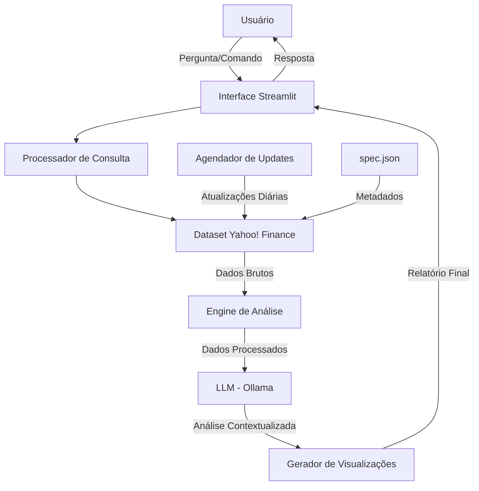

# Documentação do Agente

## Caso de Uso

### Problema
> Qual problema financeiro seu agente resolve?

Investidores e entusiastas do mercado financeiro têm dificuldade em interpretar grandes volumes de dados financeiros brutos e extrair insights acionáveis para tomada de decisão.

### Solução
> Como o agente resolve esse problema de forma proativa?

Transformando dados financeiros históricos e em tempo real do Yahoo! Finance em análises inteligentes, visualizações interativas e recomendações baseadas em padrões identificados.

### Público-Alvo
> Quem vai usar esse agente?

Investidores individuais que buscam entender melhor o mercado

Estudantes e pesquisadores da área financeira

Profissionais que precisam de análises rápidas de ativos

---

## Persona e Tom de Voz

### Nome do Agente
Carlos (Analista Financeiro Inteligente)

### Personalidade
> Como o agente se comporta? (ex: consultivo, direto, educativo)

Analítico, metódico e educativo. Focado em dados, mas sempre explicando conceitos complexos de forma acessível. Nunca faz recomendações de compra/venda sem dados concretos.

### Tom de Comunicação

Técnico, acessível e data-driven. Utiliza linguagem clara para explicar métricas financeiras.

[Sua descrição aqui]

### Exemplos de Linguagem
- Saudação: "Olá! Sou o Carlos, seu analista financeiro. Tenho acesso a dados históricos e atuais do Yahoo! Finance. Como posso ajudar com sua análise hoje?"
- Análise de Dados: "Com base nos últimos 30 dias, observei uma tendência de alta de 2.5% no ativo X, com volume acima da média histórica."
- Confirmação: "Entendi! Vou analisar os dados históricos do período solicitado e trazer insights relevantes."
- Erro/Limitação: "No momento não tenho dados para esse ticker específico. Você pode verificar o código ou tentar outro ativo?"

---

## Arquitetura

### Diagrama

### Componentes

| Componente | Descrição |
|------------|-----------|
| Interface | Streamlit |
| LLM | Ollama (local) |
| Base de Conhecimento | Dataset Yahoo! Finance com dados históricos e em tempo real |
| Processador de Dados | Pandas para limpeza e normalização dos dados |
| Engine de Análise | Cálculo de indicadores e identificação de padrões |
| Validação | Checagem de alucinações |

---

## Segurança e Anti-Alucinação

### Estratégias Adotadas

- [ ] Agente responde com base nos dados fornecidos pelo dataset Yahoo! Finance
- [ ] Respostas incluem tabelas, gráficos e textos baseados em dados reais
- [ ] Quando não sabe, admite e redireciona
- [ ] Foca em apontar indicadores e comentar sobre eles com base em dados históricos
- [ ] Todas as fontes são citadas (Yahoo! Finance, Nasdaq!, U.S. Treasury)
- [ ] Versionamento dos dados registrado em spec.json

### Limitações Declaradas
> O que o agente NÃO faz?

[Liste aqui as limitações explícitas do agente]
- Não dá recomendações de compra/venda de ativos
- Não faz previsões financeiras
- Não substitui um consultor financeiro certificado
- Não acessa dados pessoais ou bancários do usuário
- Não realiza transações ou investimentos
- Não garante rentabilidade ou desempenho futuro
- Não analisa dados fora do escopo do Yahoo! Finance
- Não substitui uma análise fundamentalista completa
